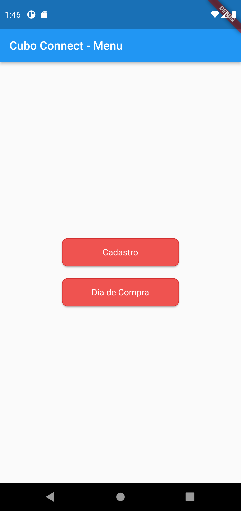
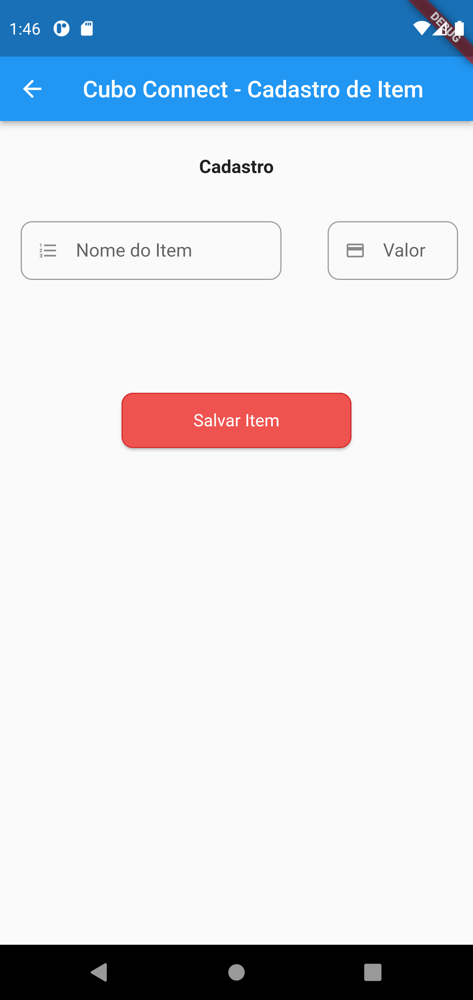
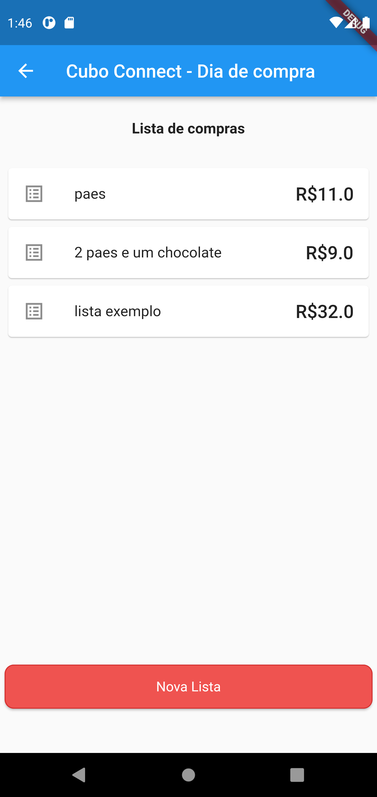
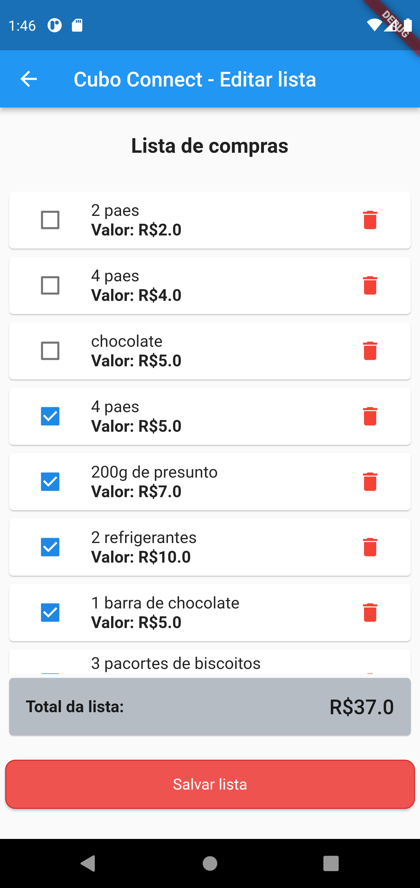
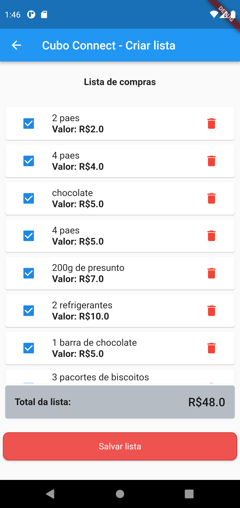
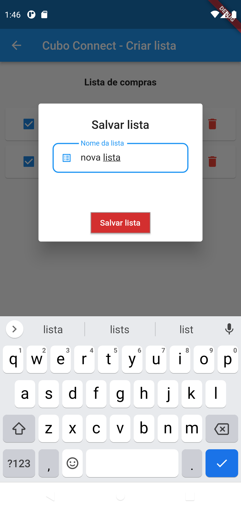

# Cubo Connect

Etapa Teste

## Utilidade do aplicativo

O aplicativo deverá ser capaz de criar listas de compras com o valor total da lista sendo recalculado conforme os itens selecionados.

Deverá ter funções de Cadastro de Itens e visualização da lista.

## Printscreens

